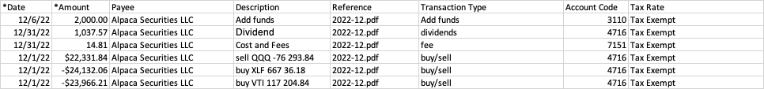

# Alpaca - XERO transaction uploads

When doing day trading using Alpaca and using XERO for accounting there can  
be very many daily transactions. To track profit and loss, for taxes or for general
accounting we need to somehow upload all transactions to XERO.

This tools utilizes the monthly statements and JSON trade confirmation files downloaded
from Alpaca [https://app.alpaca.markets/account/documents](https://app.alpaca.markets/account/documents)
to build CSV files that can be imported into XERO.

Consider doing this only at the end of each month.

### Data collection:
#### Option 1
1. Go to Alpaca [https://app.alpaca.markets/account/documents](https://app.alpaca.markets/account/documents)
2. filter for `Account statement` and download to a folder like `Doc YYYY/statements`
3. In the place you downloaded this tool to, CD to `src` directory and create `config.py` that contains:
    - `TRADES_JSON_DIR = '<path to trade confirmation JSON files>`
    - `DESTINATION_DIR = '<path to output excel files>`
4. In the Alpaca documents page, filter for `Trade confirmation JSON` and   
   Download all the files to `TRADES_JSON_DIR`

### Process steps:

1. Create monthly Excel files `YYYY-MM Statement.xlsx`
    - Run `python3 <path to code>/prep_monthly_transaction_xero_csv.py`  
      This will save excel files to `DESTINATION_DIR`
2. Adjust Excel files for other transactions
    - Open each month statement PDF and `YYYY-MM Statement.xlsx`
    - Check the Statement for any Added/Removed funds
    - Check the Statement for `Cost and Fees`
    - Check the Statement for `Dividend`
    - Add those to the Excel with the proper account info, see image in the [References](## References) below
3. VERY IMPORTANT: the dates on the JSON might not be exactly as the statements. This is important particularly  
   for the start of the year and the end of the year.  
   For example I see trades that were made on 12/29/23 showing in Jan 2024.
4. Once the Excel is up-to-date, save it as a `CSV` file, so the it can be imported to XERO

#### Option 2
1. Use [create_csv_using_apis.py](create_csv_using_apis.py) to collect trades info and create the CSV  
   using Alpaca API.  
2. Compare to the statements, to make sure it worked well.

## References

The Excel/CVS files need to look like:  
   
CSV file
columns: `*Date`, `*Amount`, `Payee`, `Description`, `Reference`, `Transaction Type`, `Account Code`, `Tax Rate`

Account codes need to match your XERO account codes:

- `3110` : `Equity` - Owner's Capital: Owner's Investment
- `4716` : `Revenue` - Alpaca Trade Transactions
- `7151` : `Expense` - Alpaca Trading fees

## Installation

- Get the code from GitHub: https://github.com/youdar/prep-alpaca-trades-for-xero
- You need to have python 3.8 or better.
- You can either use git clone the code or download the ZIP file and extract it in the place you want to run it
- In the place you downloaded this tool to, CD to `src` directory and create `config.py` that contains:
    - `TRADES_JSON_DIR = '<path to trade confirmation JSON files>`
    - `DESTINATION_DIR = '<path to output excel files>` 

   
